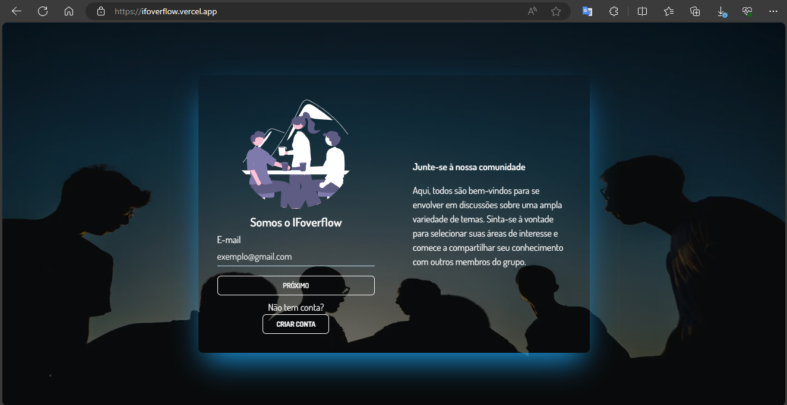

# IFoverflow: um Sistema de Perguntas e Respostas com aplicação da Teoria do Caos

Este projeto é parte integrante do Trabalho de Conclusão de Curso (TCC) intitulado "Geração de Conhecimento: Uma Aplicação da Teoria do Caos em um Sistema de Perguntas e Respostas". O IFoverflow é uma plataforma que explora a convergência entre a Teoria do Caos e ambientes digitais, oferecendo uma abordagem única para a geração dinâmica de conhecimento.

## Resumo do Artigo

O IFoverflow é uma expressão prática da aplicação da Teoria do Caos em um ambiente digital, especialmente focado a geração de conhecimento em sistemas de perguntas e respostas. Este estudo destaca a crescente complexidade desses ambientes, introduzindo a Teoria do Caos como uma abordagem promissora para compreender dinâmicas complexas e imprevisíveis. A metodologia empregada englobou uma pesquisa exploratória sobre o caos e conhecimento, e em paralelo pelo desenvolvimento da rede social IFoverflow. A análise das características caóticas presentes no software durante a criação do conhecimento foi um aspecto central do estudo, evidenciando como o caos está intrinsecamente presente nesse sistema interativo de perguntas e respostas, contribuindo para a geração de conhecimento de maneira inovadora.

## Instruções de Execução

Para executar o IFoverflow localmente, siga os passos abaixo:

1. Certifique-se de ter o Node.js instalado em sua máquina. Caso não tenha, faça o download e a instalação em https://nodejs.org/.

2. Instale o gerenciador de pacotes pnpm globalmente utilizando o seguinte comando:

   ```bash
   npm install -g pnpm
   ```

3. Navegue até o diretório principal do projeto e execute o seguinte comando para instalar as dependências:

   ```bash
   pnpm install
   ```

4. Após a conclusão da instalação, execute o projeto localmente com o seguinte comando:

   ```bash
   pnpm dev
   ```

5. Abra o navegador e acesse `http://localhost:3000` para interagir com o IFoverflow.

## Acesso Online

Você também pode acessar o IFoverflow online [aqui](https://ifoverflow.vercel.app/), explorando as funcionalidades diretamente na plataforma hospedada.
